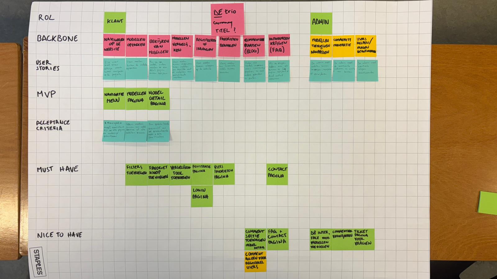
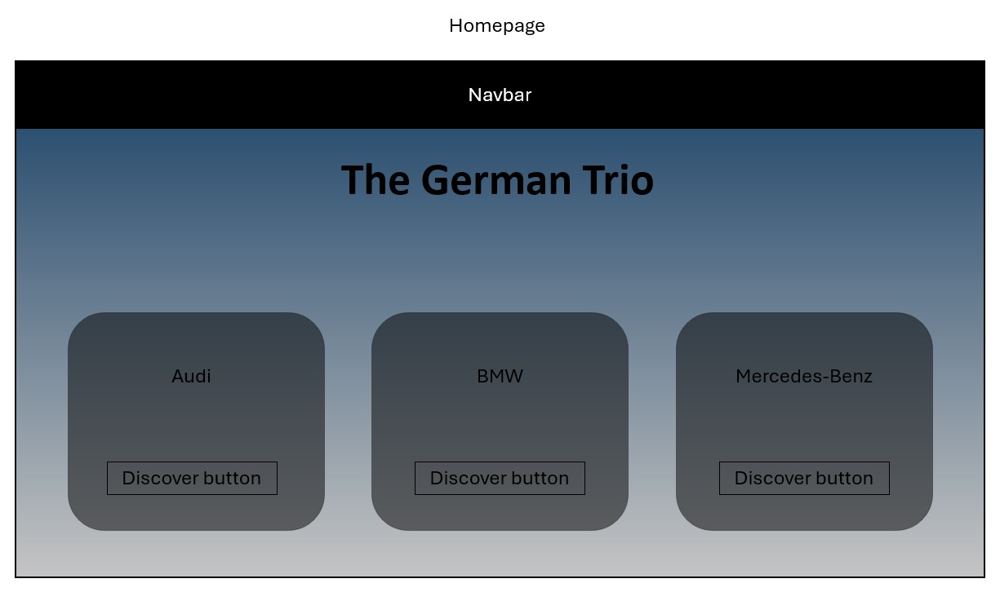
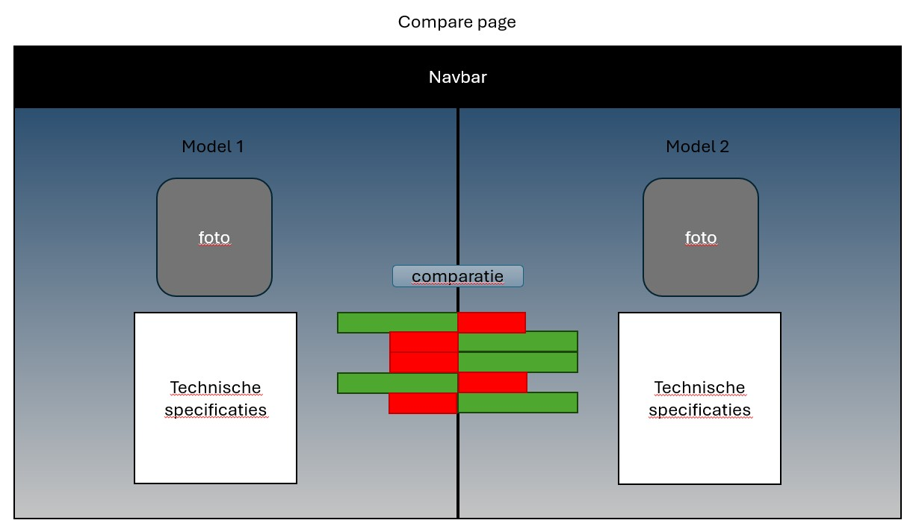

# 💻 Product Visie
## 1. Product beschrijving.
Dit is een website die ik gemaakt heb voor mensen die moelijk een keuze kunnen maken bij het kiezen van een van de 3 grootste en belangrijkste Duitse merken (Audi, BMW en Mercedes-Benz)
* Wat? Ik maak deze website om de verschillende modellen te bekijken en vergelijken.
* Voor wie? Voor mensen die geen verduidelijking kunnen online krijgen voor hun keuze.
* Waarom? Ik had het ook moeilijk bij het kiezen van mijn auto, en aangezien dat het geen t-shirt of jas is dat je kunt terug brengen, had ik graag zo een website gehad toen ik het nodig had.

## 2. User story mapping

## 3. Personas
### 1) Lena - De praktische premium-zoeker
* **Gebruikersgroep:** Gezinnen en praktisch ingestelde kopers die op zoek zijn naar een betrouwbare premium SUV (zoals de Audi Q3, BMW X1 of Mercedes-Benz GLA).
* **Behoeften:** Transparante, direct vergelijkbare data over interieurruimte (kofferbakinhoud in liters), brandstofverbruik en standaard aanwezige veiligheidssystemen.
* **Doelen:** Een veilige, ruime auto vinden die past bij het dagelijkse gezinsleven, zonder onnodig geld uit te geven aan dure pret-pakketten.
* **Pijnpunten:** Ondoorzichtige en complexe optielijsten van Duitse merken, en de angst voor verborgen of hoge onderhoudskosten.
### 2) Felix - De prestatie-purist
* **Gebruikersgroep:** Autoliefhebbers en sportieve rijders die puur gefocust zijn op rijdynamiek en harde cijfers (zoals de BMW M240i, Audi RS3 of Mercedes-AMG CLA 45).
* **Behoeften:** Toegang tot rauwe, gedetailleerde technische specificaties in één overzicht (pk's, koppel, 0-100 km/u tijden, type aandrijflijn en gewicht).
* **Doelen:** De best presterende en meest dynamische auto binnen het budget vinden om de ultieme rijbeleving te garanderen.
* **Pijnpunten:** Gefrustreerd door marketingpraatjes en lifestyle-foto's op dealerwebsites; het kost te veel tijd om technische data op te graven en naast elkaar te leggen.
### 3) Marcus - De tech-gedreven exec
* **Gebruikersgroep:** Zakelijke veelrijders (leaserijders) die de overstap maken naar het hogere segment elektrische auto's (zoals de Mercedes-Benz EQE, BMW i5 of Audi A6 e-tron).
* **Behoeften:** Duidelijk inzicht in accucapaciteit (kWh), DC-snellaadtijden (10-80%), werkelijke actieradius en de nieuwste rijhulpsystemen/infotainment.
* **Doelen:** De ultieme, toekomstbestendige en comfortabele elektrische reisauto selecteren voor lange zakelijke ritten.
* **Pijnpunten:** Tijdgebrek voor bezoeken aan meerdere fysieke showrooms en een absolute hekel aan trage, onoverzichtelijke software in auto's.

# 💻 Functionale analyse
## 1. Wireframes

Dit is hoe mijn homepagina ongeveer eruit gaat zien.

Dit is hoe ik wil dat mijn compare pagina ongeveer eruit ziet.
